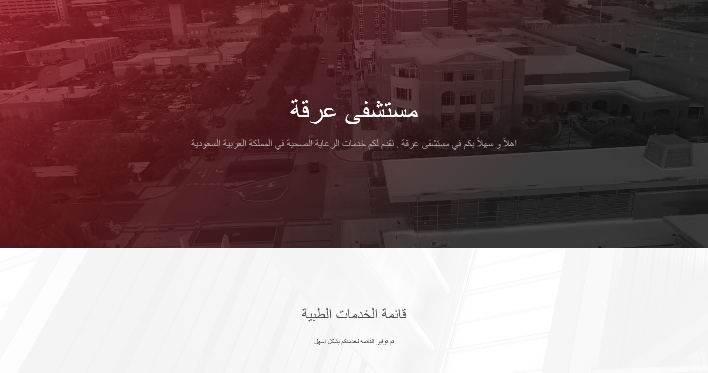
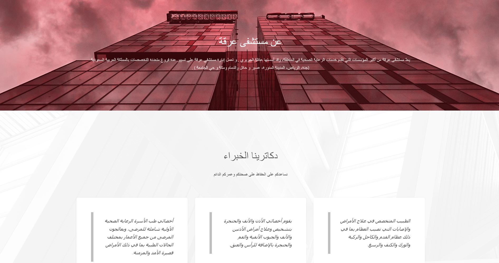
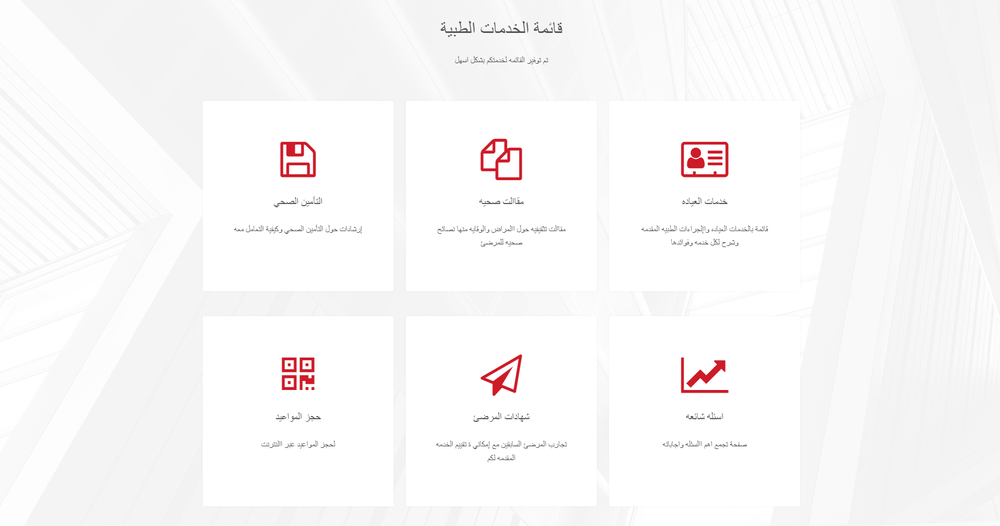
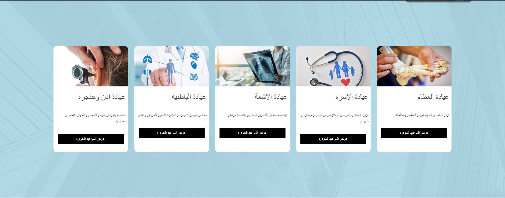

# Erqah Hospital Appointments Booking Website

## Table of Contents

1. [Project Overview](#project-overview)
2. [Demo Video](#demo-video)
3. [Project Report Details](#project-report-details)
4. [Abstract](#abstract)
5. [Technologies Used](#technologies-used)
6. [Design and Implementation](#design-and-implementation)
7. [Functionality](#functionality)
8. [Future Enhancements](#future-enhancements)
9. [Acknowledgments](#acknowledgments)
10. [Installation](#installation)
11. [File Structure](#file-structure)
12. [Database](#database)
13. [Screenshots](#screenshots)
14. [Conclusion](#conclusion)

## Project Overview

The **Erqah Hospital Appointments Booking Website** is a web-based application developed to streamline the process of scheduling medical appointments. The primary goal is to offer a user-friendly platform where patients can effortlessly book appointments with various doctors across different clinics and view these appointments in their profile accounts. Additionally, the site provides options for users to contact hospital support for assistance.

## Demo Video

A demo video of the project is available on [YouTube](https://www.youtube.com/watch?v=your-video-id).

## Project Report Details

- **Under the supervision of:** Dr. Mudather
- **Team Leader:** Mohammed Aleshawi
- **Team Members:** Mohammed Aleshawi, Mbarak Aldosari, Abdulelah Alshrane, Ibrahim Alfadhel, Ghassan Alasmari
- **Date:** 8th January 2024
- **Subject:** Internet Programming
- **Level:** 5
- **Class:** Programming major 171

## Abstract

The project involved developing a user-friendly website to facilitate booking appointments at Erqah Hospital. The website uses HTML for structure, CSS for design, JavaScript for dynamic functionality, and PHP for server-side scripting. The project aims to simplify the appointment booking process for patients and provide a seamless user experience.

## Technologies Used

1. **HTML**: For the basic structure and layout of the web pages.
2. **CSS**: For enhancing the visual appeal and design of the website.
3. **JavaScript**: For adding interactivity and client-side validation.
4. **PHP**: For server-side scripting and database communication.

## Design and Implementation

### Design Approach

- **User-Friendliness**: Clear layout and intuitive navigation.
- **Visual Appeal**: Professional color scheme and typography suitable for a healthcare setting.
- **Responsive Design**: Ensuring compatibility with various devices using CSS.

### Implementation Challenges

- Managing diverse appointments for different clinics and doctors.
- Displaying these appointments accurately in the user's profile.
- Ensuring real-time validation and responsive design for better user experience.

### Team Roles

- **Mohammed Aleshawi**: Team Leader, Back-end, Front-end, Database, Documentation.
- **Abdulelah, Ghassan, Ibrahim**: Front-end development.
- **Mubarak**: Front-end development and communication.

## Functionality

### Key Features

- **Appointment Booking**: Patients can book appointments with doctors across various clinics.
- **User Profile Management**: Users can view their upcoming appointments and past visit histories.
- **Contact Support**: Users can reach out to hospital support or administration for assistance.

### Special Functionalities

- **Real-Time Validation**: Ensuring data accuracy using JavaScript.
- **Responsive Design**: Maintaining functionality and visual appeal across different devices.

## Future Enhancements

- Automatic appointment reminders.
- Patient feedback system.
- Integration with electronic health records.

## Acknowledgments

Special thanks to **[Templated](https://templated.co/)** for providing valuable CSS templates that significantly enhanced the design and user interface of the site.

This project is intended solely for learning purposes. I am not responsible for any uses or misuses of this project. It is a college project for one of my courses, where we decided to use this idea because there is a real Erqah Hospital under construction. We thought it would be a great idea to create a system since they haven't made one yet. This project is to showcase our programming skills, and neither I, my team, nor Imam Mohammad Ibn Saud Islamic University are responsible for any other use.
## Installation

To get a local copy up and running, follow these simple steps:

### Prerequisites

- PHP
- MySQL
- A web server (e.g., Apache, Nginx)

### Setup

1. **Clone the repository:**

   ```bash
   git clone https://github.com/yourusername/imamu-project.git
   ```

2. **Navigate to the project directory:**

   ```bash
   cd imamu-project
   ```

3. **Set up the database:**

   - Import the `hospital_reservation_db.sql` file into your MySQL database.

4. **Configure the database connection:**

   - Update the `config.php` file with your database credentials:

   ```php
   <?php
   $servername = "your_servername";
   $username = "your_username";
   $password = "your_password";
   $dbname = "hospital_reservation_db";

   $conn = new mysqli($servername, $username, $password, $dbname);

   if ($conn->connect_error) {
       die("Connection failed: " . $conn->connect_error);
   }
   ?>
   ```

## File Structure

### HTML Files

- **about.html**: About Us page providing information about the hospital and its team.
- **ClinicType.php**: Page for selecting clinic types and viewing available appointments.
- **ContactUs.php**: Contact Us page for users to reach out to hospital support.
- **Doctors.php**: Page for viewing doctors associated with a selected clinic type.
- **FAQs.html**: Frequently Asked Questions page.
- **index.php**: Home page of the website.
- **login.php**: Login page for users.
- **profile.php**: Profile page for users to view and manage their appointments.
- **Rating.php**: Page for users to rate the services.
- **SignUp.php**: Sign-up page for new users.

### PHP Files

- **BookAppointment.php**: Handles the appointment booking process.
- **config.php**: Contains database connection settings.
- **logout.php**: Handles user logout.

### CSS Files

- **about.css**
- **ClinicType.css**
- **ContactUs.css**
- **Doctors.css**
- **FAQs.css**
- **login.css**
- **profile.css**
- **Rating.css**
- **SignUp.css**

### JavaScript Files

- **SignUp.js**: Handles client-side validation for the sign-up form.

### Assets

- **assets/css/main.css**: Main CSS file.
- **assets/js/main.js**: Main JavaScript file.
- **images/**: Directory containing images used in the website.

### Additional Files

- [**Credit.pdf**](./Credit.pdf): Project report and credits.
- **hospital_reservation_db.sql**: SQL file for database setup.

## Database

The database for the project includes tables to manage users, doctors, clinics, and appointments. A schema of the database and images of the website provide a visual overview of the database structure and the website's appearance.

## Screenshots


_Home Page_


_About the Hospital_


_Medical Service_


_Appointment Booking Page_

## Conclusion

The Erqah Hospital Appointments Booking Website successfully simplifies the process of booking medical appointments, providing a user-friendly, efficient, and responsive platform. The project showcases advanced web development skills and addresses a functional need for Erqah Hospital. Future enhancements can further improve the system, adding more value to the hospital's operations and patient experience.
